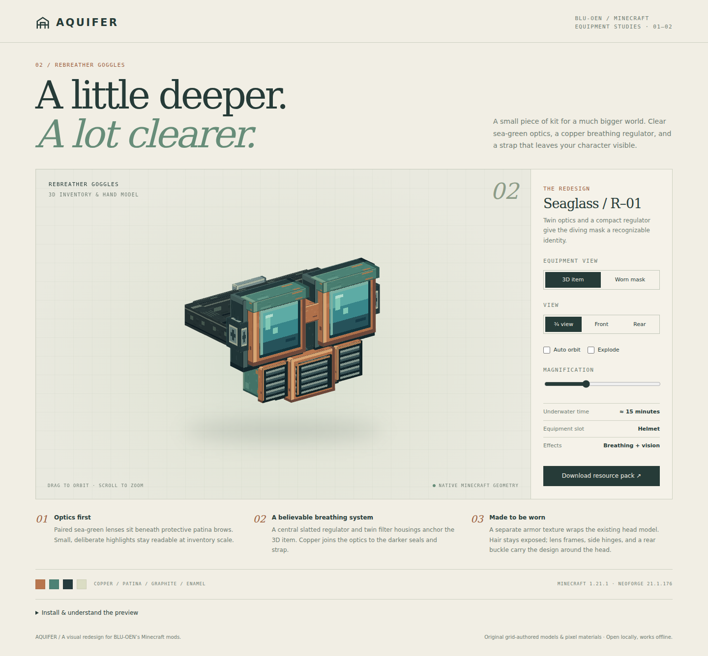

# Redesign for rebreather — Seaglass / R–01

Part of **Aquifer**, a shared visual direction for BLU-OEN’s Minecraft equipment: weathered copper, dark metal, patina and sea glass.

A diving mask with copper lens frames, sea-green optics, protective patina brows, rubber seals, a central slatted regulator, twin filter housings and a woven strap. The held/inventory item gets a sculpted 3D model. The equipped mask gets its own 128 × 64 pixel armor texture, retaining exposed hair and the original head layer.



## Open the design

Download this folder, then double-click **redesign for rebreather.html**. The file includes the model, textures and resource-pack download, so it works offline without a server or JavaScript packages. GitHub displays HTML source; open a downloaded copy in a browser.

Drag to orbit, scroll to zoom, or focus the canvas and use the arrow and +/− keys. Use the view and equipment/state controls to inspect the design. Explode separates components for inspection only. Automatic orbit is off by default; rotor animation respects reduced-motion preferences.

## Use in Minecraft

1. Keep the original mod installed in Minecraft **1.21.1 / NeoForge 21.1.176**.
2. Copy **redesign-for-rebreather.zip** into the instance’s `resourcepacks` folder. Leave it zipped.
3. Enable the pack above the mod’s built-in resources in **Options → Resource Packs**.
4. Inspect the item and worn/block appearances in your test world.

This is an optional client resource pack (pack format 34). It needs no server installation and adds no Java dependencies.

## What is included

- `redesign for rebreather.html`: self-contained interactive preview and ZIP download.
- `redesign for rebreather.json`: standalone editable Java Block/Item geometry.
- `resource-pack/`: unpacked game assets using the mod’s existing namespace.
- `redesign-for-rebreather.zip`: installable pack, with `pack.mcmeta` at the archive root.
- `build.mjs`: original grid-authored geometry and pixel-material generator; no dependencies.
- `preview-template.html`: editable viewer layout and WebGL renderer.
- `validate.mjs`: asset references, UV, image and state checks.

For Blockbench, import the model JSON as a Java Block/Item model and load `resource-pack/assets/rebreathergoggles/textures/redesign/materials.png` as its materials texture. The equipped armor is edited separately in textures/models/armor/rebreather_layer_1.png.

## Rebuild

From this folder, using Node.js 18 or later:

```sh
node build.mjs
node validate.mjs
```

The build regenerates geometry, PNG textures, the ZIP and the offline preview. Edit the build source before rebuilding; generated asset edits are overwritten. `preview.png` is a browser capture and is not regenerated by this command.

## Rendering scope

Minecraft renders equipped armor independently of its item model. The equipped design uses the existing head armor cuboid and its vanilla UV layout. Raised filter geometry appears on the 3D item, not on the player; adding that to the player would need a custom armor renderer. The preview’s **Worn mask** mode shows the actual supplied armor texture on a neutral head. The original breathing, night vision, durability and crafting behavior stays in the mod.

The browser uses exported geometry and textures with studio lighting. Minecraft’s world lighting, mipmaps, player skin and equipped armor rendering can look different. Asset validation and browser checks have been run; **these redesigns have not been tested inside Minecraft**.

## Format references

- [NeoForge 1.21–1.21.1 model specification](https://docs.neoforged.net/docs/1.21.1/resources/client/models/)
- [Minecraft 1.21 resource pack version 34](https://www.minecraft.net/en-us/article/minecraft-java-edition-1-21)

License: MIT, as in the parent repository.
